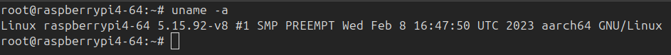
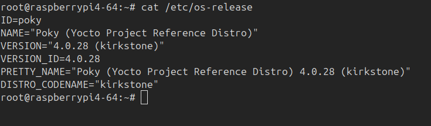
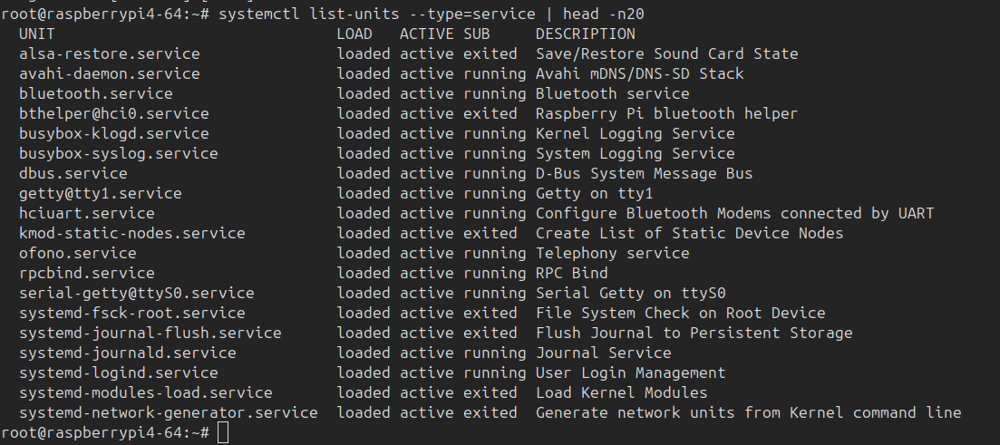
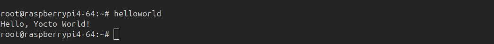
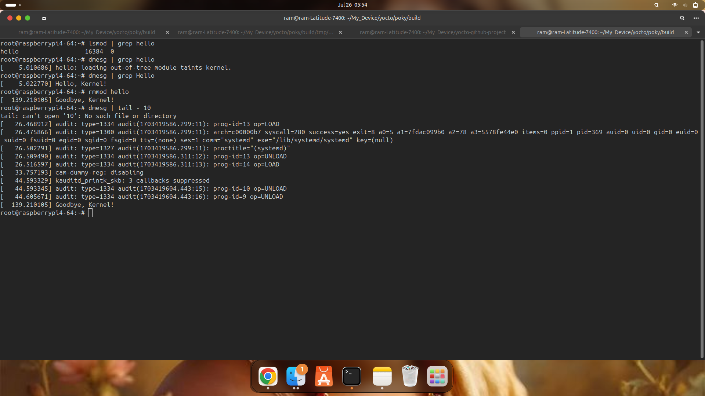
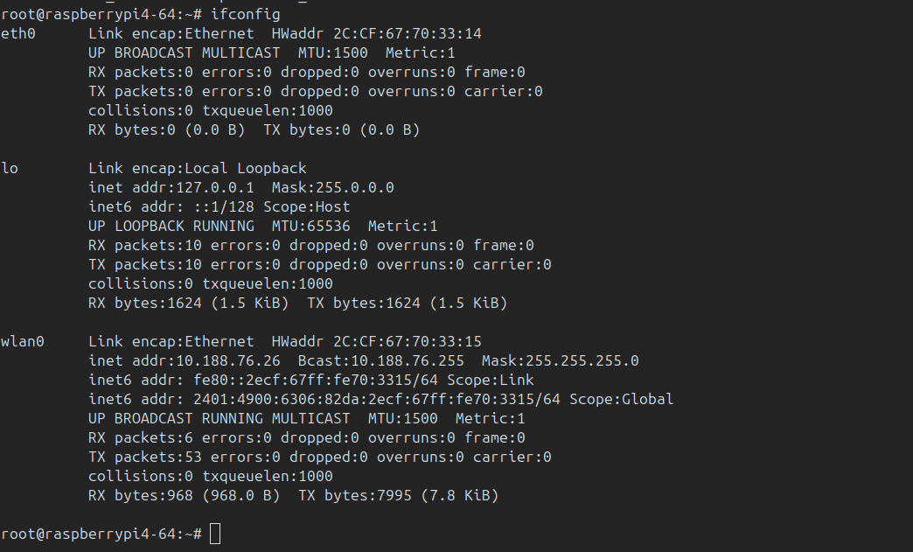
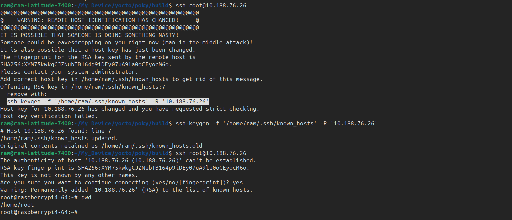
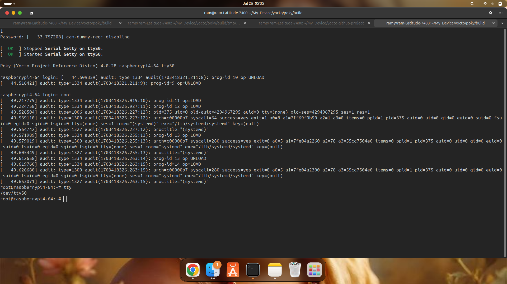
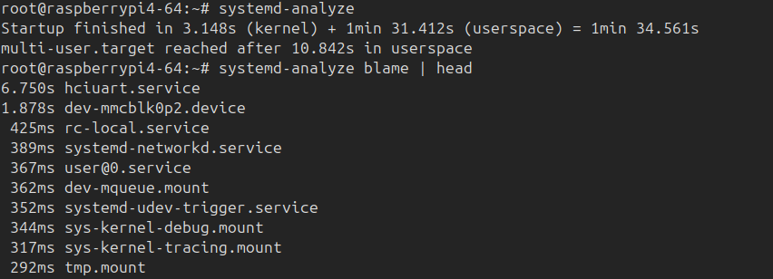
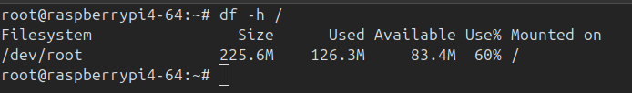

# Yocto Linux Build for Raspberry Pi 4

This project demonstrates how to build a custom embedded Linux image for Raspberry Pi 4 using the **Yocto Project**.  
It includes UART support, a custom kernel module (`hello.ko`), and a simple recipe (`helloworld`) added to the image.

## 📌 Project Info
- **Project Duration:** July 2025  
- **Author:** Ramkumar B  
- **Description:** A custom Yocto build for Raspberry Pi 4B with kernel module integration and Wi-Fi support.

---

## 📁 Project Structure

├── build-notes.txt
├── conf
│   ├── bblayers.conf
│   └── local.conf
├── helloworld
│   ├── files
│   │   └── helloworld.c
│   └── helloworld_1.0.bb
├── images
│   ├── core-image-base-raspberrypi4-64.wic.bmap
│   └── core-image-base-raspberrypi4-64.wic.bz2
├── LICENSE
├── README.md
├── recipes-example
│   └── hello-module
│       ├── files
│       │   ├── hello.c
│       │   └── Makefile
│       └── hello-module_0.1.bb
├── rpi-boot-config
│   ├── cmdline.txt
│   └── config.txt
├── screenshots
│   ├── df_output.png
│   ├── directory_structure.png
│   ├── helloworld_output.png
│   ├── kernel_module_hello_logs.png
│   ├── os_release.png
│   ├── ssh.png
│   ├── systemctl_services.png
│   ├── systemd_analyze.png
│   ├── uart_login.png
│   ├── uname_output.png
│   └── wifi_configuration.png
└── wifi_setup.md


## 🛠️ Features Included

- ✅ **UART Enabled** (via `enable_uart=1` and bootargs)
- ✅ **SSH Access** and basic shell
- ✅ **Custom kernel module** `hello.ko`
- ✅ **User-defined recipe** `helloworld_1.0.bb`
- ✅ Built on top of `core-image-base`

---

## 🧪 Tested Components

| Component | Status |
|----------|--------|
| UART Terminal (screen) | ✅ |
| SSH Login | ✅ |
| Custom Module (`hello.ko`) | ✅ Loaded and removed with logs |
| Helloworld Recipe | ✅ Runs with expected output |


## 📸 Screenshots

### 🔧 Kernel Info  
This screenshot shows the output of `uname -a`, confirming:
- The board is Raspberry Pi 4 (`raspberrypi4-64`)
- Kernel version is `5.15.92-v8`
- The architecture is `aarch64`



---

### 🧾 OS Release Info  
This verifies the OS built from Yocto, with metadata like distro name, version, and ID.



---

### 🔁 Active Systemd Services  
Demonstrates systemd boot and active services (like `sshd`, `getty`, etc.) using:

```bash
systemctl list-units --type=service
```



---

### 🧪 Custom Recipe Output (`helloworld`)  
Displays the output of the custom Yocto recipe `helloworld`, verifying the recipe is correctly built into the image.



---

### 🧩 Kernel Module Verification  
The following screenshot shows:
- The `hello.ko` module is loaded (`lsmod`)
- Metadata from `modinfo` (license, version, path)
- Kernel logs using `dmesg`
- Module cleanup using `rmmod`



---

### 🌐 Wi-Fi Connectivity  
This screenshot shows `ifconfig` output, verifying Wi-Fi (wlan0) and Ethernet interfaces are up with valid IP addresses.



---

### 🔐 SSH Login  
Screenshot showing successful login to the board via SSH terminal.



---

### 🖥️ UART Shell Access  
This screenshot shows UART access using a serial terminal (`ttyS0`).  
It confirms that:
- `enable_uart=1` is configured correctly in `config.txt`
- Bootargs include `console=ttyS0,115200`
- The system boots fully without HDMI
- Login over UART as `root` is successful

You can see the serial getty started on `ttyS0`, followed by a successful login and shell access.



---

### ⏱️ Boot Time Analysis (`systemd-analyze`)  
This screenshot shows the output of `systemd-analyze`, which reports how long the system took to boot. It includes:
- Kernel initialization time
- Userspace startup time
- Total boot duration

You can also run:
```bash
systemd-analyze blame
```
To list the boot time of each service.



---

### 💾 Disk Usage Overview (`df -h`)  
This screenshot shows the available and used disk space on each mounted filesystem.

```bash
df -h
```



## 👤 Author

**Ramkumar B**  
🕓 2025  
📘 Licensed under the MIT License
